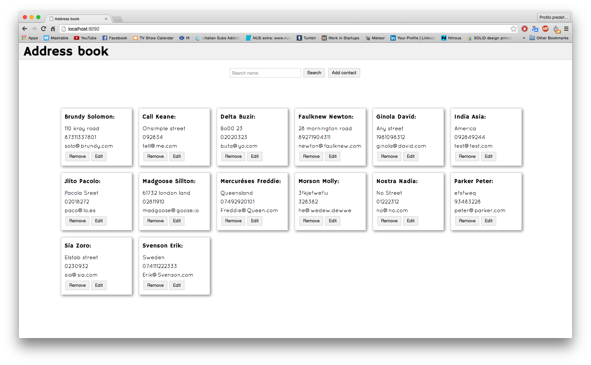

[](https://codeclimate.com/github/elenagarrone/address_book-exercises)

Address book + JS exercises
===========================
This test was definitely a challenge for me, I'm not gonna lie! It's probably far from perfect but I feel like I've learned a massive amount of new things while doing it and I have really enjoyed it.

###exercises1-7_JS:
A few exercises in JavaScript, tested with Jasmine.

#####How to test:
Clone the repo:
```shell
$ git clone https://github.com/elenagarrone/address_book-exercises.git
```
Change into the directory:
```shell
$ cd address_book-exercises/exercises1-7_JS
```
Run RSpec:
```shell
$ rspec
```

###exercise8_JS:
This is a simple single page address book application built using Sinatra.



######Specification:
Contacts:
- are listed in alphabetical order
- can be added, edited and removed
- have a name(required), surname(required), address, phone number, email
- can be searched using a search field

######Technologies:
- JavaScript
- Jquery
- HTML
- CSS
- Sinatra
- API
- RSpec
- Jasmine

######How to use:
Clone the repo:
```shell
$ git clone https://github.com/elenagarrone/address_book-exercises.git
```
Change into the directory:
```shell
$ cd address_book-exercises/exercise8_JS
```
Install the gems:
```shell
$ bundle install
```
Try it on localhost:
```shell
$ rackup
#then on the browser go to:
localhost:9292
```

######How to test:
From inside the repo run:
```shell
$ rspec
```
